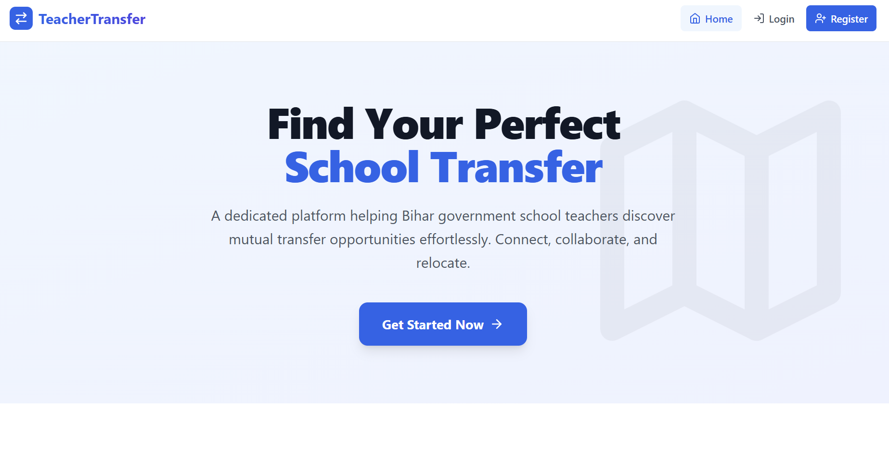
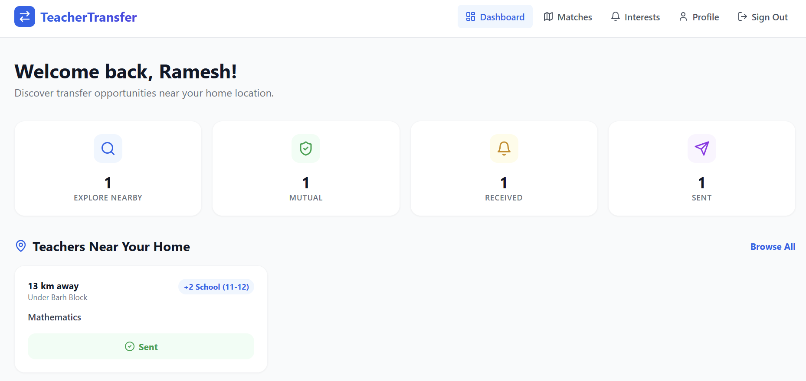
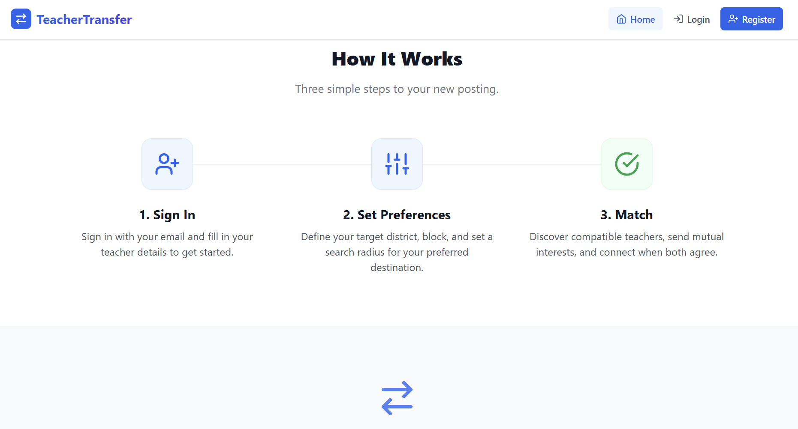
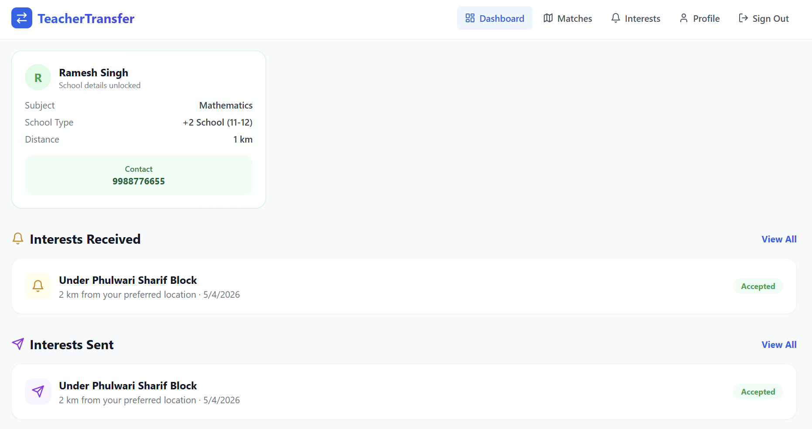

<p align="center">
  
</p>

<h1 align="center">🏫 TeacherTransfer</h1>
<p align="center">
  <em>Find your perfect school transfer match — no paperwork, no bureaucracy, just teachers helping teachers.</em>
</p>

<p align="center">
  <strong>Bihar · Government Schools · Mutual Transfers</strong>
</p>

---

TeacherTransfer is a peer-to-peer platform for Bihar government school teachers who want to swap postings. You tell us where you are, where you want to go, what subject you teach — and we find other teachers who match the other way around.

Direct swap. No endless paperwork. Just a clean, map-powered platform that does the matching for you.

---

## 📸 Screenshots

<table align="center">
  <tr>
    <td align="center"><strong>Home Page</strong></td>
    <td align="center"><strong>Dashboard — Overview</strong></td>
  </tr>
  <tr>
    <td align="center"></td>
    <td align="center"></td>
  </tr>
  <tr>
    <td align="center"><strong>Home Page (bottom)</strong></td>
    <td align="center"><strong>Dashboard — Matches</strong></td>
  </tr>
  <tr>
    <td align="center"></td>
    <td align="center"></td>
  </tr>
</table>

---

## ✨ What You Can Do

- **📍 Location-based matching** — Tell us your preferred district & block, we find teachers in that area who want to go where *you* are now. Powered by geohash + Haversine distance.
- **🔄 Mutual transfers** — Simple two-way swap.The algorithm figures it out.
- **🎯 Filter by subject & school type** — Only show matches that actually make sense (a middle school Hindi teacher matches with another middle school Hindi teacher).
- **🗺️ Interactive map** — See potential matches on a real map. Pan around Bihar, zoom into blocks.
- **🔔 Get notified** — When someone sends interest, accepts your request, or a new match is found. Email notifications included.
- **📱 Works on your phone** — No app to install. Open it in the browser on any device.
- **🗄️ All 38 districts & 500+ blocks of Bihar** — Geography data built in.

---

## 🛠️ Tech Stack

### Backend

| What | Thing |
|------|-------|
| Language | Java 17 |
| Framework | Spring Boot 3.2 |
| Database | PostgreSQL 15 + JPA/Hibernate |
| Auth | JWT (jjwt),  Email OTP |
| Spatial | Geohash (davidmoten/geo) + Haversine |
| Payments | Razorpay |
| Email | SMTP (SendGrid / Mailtrap / any SMTP) |
| SMS | MSG91 (OTP delivery) |

### Frontend

| What | Thing |
|------|-------|
| Framework | Next.js 14 (App Router) |
| Language | TypeScript |
| Styling | Tailwind CSS |
| Maps | Leaflet.js + OpenStreetMap |
| Auth | NextAuth.js |
| Icons | Lucide React |

### Infrastructure

| What | Thing |
|------|-------|
| Containers | Docker + Docker Compose |
| Reverse Proxy | Nginx (rate limiting, SSL termination) |
| SSL | Let's Encrypt |

---

## 🚀 Getting Started

You'll need **Docker** and **Docker Compose** to run the full stack. Or run backend/frontend locally if you prefer.

### 1. Clone it

```bash
git clone https://github.com/<your-org>/TeacherTransfer.git
cd TeacherTransfer
```

### 2. Configure environment

```bash
cp .env.example .env
```

Edit `.env` with your credentials. For local development, just set `EMAIL_PROVIDER=log` and leave the SMS/payment keys blank — the app will work without them (just no OTP or payments).

### 3. Fire it up with Docker

```bash
docker compose -f docker/docker-compose.yml up -d
```

That's it. The stack boots up in a minute:

| Service | URL |
|---------|-----|
| Frontend | http://localhost:3000 |
| API | http://localhost:8080/api |
| Database | `localhost:5432` |

### 4. Or run locally for development

**Backend:**
```bash
cd backend
mvn clean install
mvn spring-boot:run
```

**Frontend:**
```bash
cd frontend
npm install
npm run dev
```

The frontend will hot-reload at `http://localhost:3000` and proxy API calls to port `8080`.

### Dev mode bonus — MailHog

Spin up `docker compose -f docker/docker-compose.yml -f docker/docker-compose.dev.yml up -d` and you get [MailHog](http://localhost:8025) — a fake SMTP server that catches all outgoing emails so you can inspect them in a web UI. No need to configure real SMTP credentials.

---

## 📁 Project Layout

```
TeacherTransfer/
├── backend/                         # Spring Boot API
│   ├── src/main/java/com/teachertransfer/
│   │   ├── controller/              # REST endpoints
│   │   ├── service/                 # Business logic
│   │   ├── entity/                  # JPA models
│   │   ├── repository/              # Database access
│   │   ├── security/                # JWT & Spring Security
│   │   ├── dto/                     # Request/response shapes
│   │   └── util/                    # Geohash utility
│   └── pom.xml
├── frontend/                        # Next.js app
│   ├── app/                         # Pages (App Router)
│   ├── components/                  # Reusable UI bits
│   ├── lib/                         # Axios client, NextAuth config
│   └── package.json
├── docker/                          # Docker & Nginx configs
│   ├── docker-compose.yml
│   ├── docker-compose.dev.yml
│   └── nginx/
└── screenshots/                     # 📸 Your screenshots here
```

## 🧪 Testing

```bash
# Backend unit & integration tests
cd backend && mvn test

# With a real Postgres via Testcontainers
cd backend && mvn test -Dspring.profiles.active=testcontainers

# Frontend linting
cd frontend && npm run lint
```

---

## 🚢 Deployment (production)

```bash
docker compose -f docker/docker-compose.yml up -d
```

Nginx handles SSL (Let's Encrypt), rate limiting (10 req/s general, 5 req/min on auth), and routes traffic to the right service. Health check at `/api/actuator/health`. Tail logs with `docker compose logs -f`.

---

## 📄 License

Proprietary — all rights reserved. Built for Bihar government school teachers. Not affiliated with any government body.

---

## 💬 Questions?

Open a GitHub issue or contact me.
